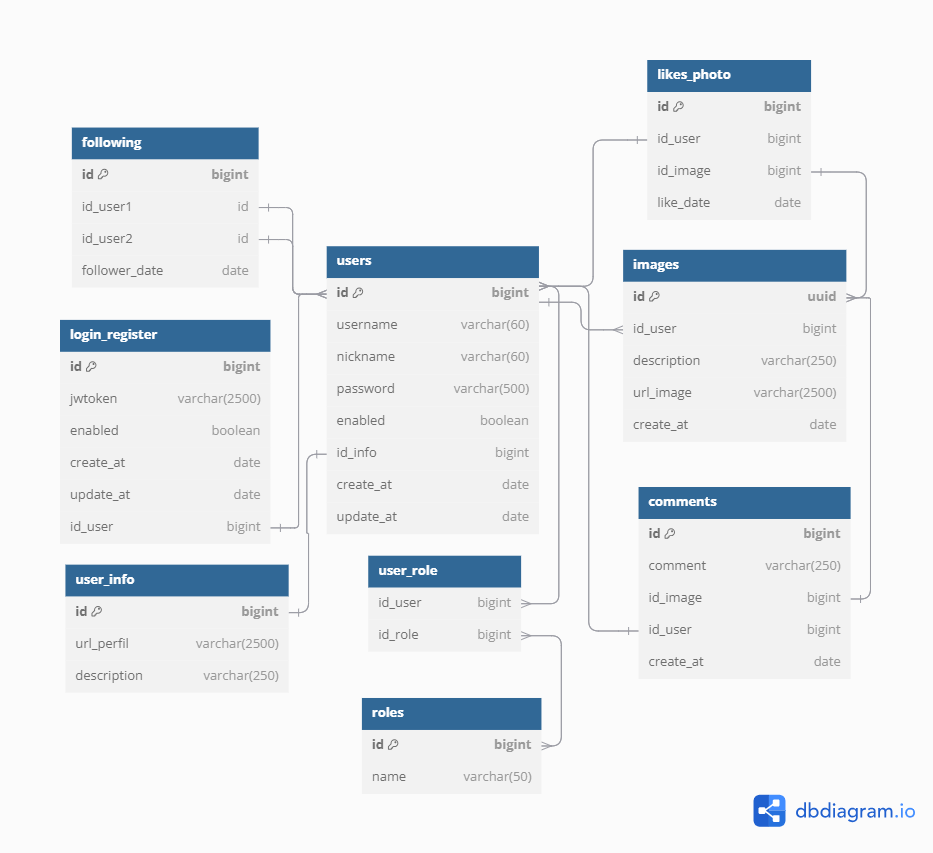

# Server My Socail Networks
 
This part describes the backend development.

## Database diagram

[](../db_diagram/db.txt "diagrama")

## Tecnhologies

- **Libraries and Frameworks:** Spring boot, Spring security, Spring web, Jsonwebtoken, Bcrypt.
- **Language**: Java
- **Software development:** Openjdk-21, Docker

## Requests and Responses

### Register

This request creates a new user with his roles, hash password and responses with a jsonwebtoken

Request path

```http
POST /api/user/register
```
Authenticate: No

Request header

```JSON
{
  "Content-Type": "application/json"
}
```
Request body

```JSON
{
  "username":"string",
  "nickname":"string",
  "password":"string",
  "description":"string",
  "urlPerfil":"string"
}
```

Response Body

```JSON
{
  "username": "string",
  "jwtoken": "string"
}
```

### Login

This request authenticates the user with their username and password to respond with a jsonwebtoken. The token is register in the database with the time it was generated.

Request path

```http
POST /api/user/login
```
Authenticate: No

Request header

```JSON
{
  "Content-Type": "application/json"
}
```
Request body

```JSON
{
  "username":"string",
  "password":"string"
}
```

Response Body

```JSON
{
  "username": "string",
  "jwtoken": "string"
}
```


### Logout

In the database there is a table called `login_register`, this table has a column called `enabled`. This request changes the `enabled` value "true" to "false" to block the token making the request.

Request path

```http
POST /api/user/logout
```
Authenticate: Yes

Request header

```JSON
{
  "Authentication": "Bearer token"
}
```

### User info and get friend info

This request gets the own user or friend info.

Request paths

- User info

```http
GET /api/user/userInfo
```

- Friend info

```http
GET /api/user/otherUser?username={username}
```

Authenticate: yes

Request header

```JSON
{
  "Authentication": "Bearer token"
}
```

Response Body

```JSON
{
  "id": "number",
  "username": "string",
  "nickname": "string",
  "description": "string",
  "urlPerfil": "string",
  "following": "number",
  "followers": "number"
}
```

### Followers and Followings

This requests get followers and followins of a user.

Request paths

- Followers

```http
GET /api/user/follow/find/followers/{idUser}?page={page}&size={size}
```

- Followings

```http
GET /api/user/follow/find/followings/{idUSer}?page={number}&size={number}
```

Authenticate: yes

Request header

```JSON
{
  "Authentication": "Bearer token"
}
```

Response Body

```JSON
{
  "users": [
    {
      "username": "string",
      "nickname": "string",
      "userInfo": {
        "id": "number",
        "urlPerfil": "string"
      }
    }
  ]
}
```

### Count follows

This requests get followers and followins numbers

Request paths


```http
GET /api/user/follow/count/{idUser}
```


Authenticate: yes

Request header

```JSON
{
  "Authentication": "Bearer token"
}
```

Response Body

```JSON
{
  "following": "number",
  "followers": "number"
}
```

### Know if it is following

This requests responses with a boolean to know if a user is following other user. The main user is from the token and the secon user is from
dynamic URL 

Request paths

```http
GET /api/user/follow/followUser?username={string}
```

Authenticate: yes

Request header

```JSON
{
  "Authentication": "Bearer token"
}
```

Response Body

```JSON
{
  "followingThisUser": "boolean"
}
```

### Search friend

This request is to search for people.

Request paths

```http
GET /api/user/search/{username or nickname}?page={number}&size={number}
```

Authenticate: yes

Request header

```JSON
{
  "Authentication": "Bearer token"
}
```

Response Body

```JSON
{
  "usernames": [
    {
      "username": "string",
      "nickname": "string",
      "userInfo": {
        "id": "number",
        "urlPerfil": "string"
      }
    }
  ],
  "nicknames": [
    {
      "username": "string",
      "nickname": "string",
      "userInfo": {
        "id": "number",
        "urlPerfil": "string"
      }
    }
  ]
}
```

### Generate follow

This request creates a new follow

Request paths

```http
POST /api/user/follow/{idUser}
```

Authenticate: yes

Request header

```JSON
{
  "Authentication": "Bearer token"
}
```

Response Body

```JSON
{
  "followingThisUser": true
}
```

### Get images

This request gets some images for home page or user profile

Request paths

- Request images for home page

```http
GET /api/images?page={number}&size={number}
```

- Request by username

```http
GET /api/images/user?username={string}page={number}&size={number}
```

Authenticate: yes

Request header

```JSON
{
  "Authentication": "Bearer token"
}
```

Response Body

```JSON
[
  {
    "id": "string",
    "urlImage": "string",
    "description": "string",
    "createAt": "string",
    "username": "string",
    "nickname": "string",
    "urlPerfil": "string",
    "comments": "number",
    "likes": "number",
    "userLike": "boolean"
  }
]
```

### Delete images

This request only deletes user images obtained from jsonwebtoken.

Request paths

```http
DELETE /api/images/{idImage}
```

Authenticate: yes

Request header

```JSON
{
  "Authentication": "Bearer token"
}
```

### Get One Image

This request gets only one image with its full information with pageable comments

```http
GET /api/images/{idImage}?size={number}&page={number}
```

Authenticate: yes

Request header

```JSON
{
  "Authentication": "Bearer token"
}
```

Response Body

```JSON
{
  "id": "string",
  "urlImage": "string",
  "description": "string",
  "createAt": "string",
  "user": {
    "username": "string",
    "nickname": "string",
    "userInfo": {
      "id": "number",
      "urlPerfil": "string"
    }
  },
  "comments": [
    {
      "id": "number",
      "createAt": "string",
      "comment": "string",
      "user": {
        "username": "string",
        "nickname": "string",
        "userInfo": {
          "id": "number",
          "urlPerfil": "string"
        }
      }
    }
  ],
  "likes": "number",
  "userLike": "booolean"
}
```

### Post new image

This request adds a new image or post.

```http
POST /api/images
```

Authenticate: yes

Request header

```JSON
{
  "Authentication": "Bearer token",
  "Content-Type": "application/json"
}
```

Request body

```JSON
{
	"urlImage":"string",
	"description":"string"
}
```

Response Body

```JSON
{
  "id": "string",
  "urlImage": "string",
  "description": "string",
  "createAt": "string",
  "username": "string",
  "nickname": "string",
  "urlPerfil": "string",
  "comments": "number",
  "likes": "number",
  "userLike": "boolean"
}
```

### Like Image

This request creates o removes a like to a image

Request paths

```http
POST /api/images/like/{idImages}
```

Authenticate: yes

Request header

```JSON
{
  "Authentication": "Bearer token"
}
```

Response Body

```JSON
{
  "idImage": "string",
  "countLikes": "number",
  "userLike": "boolean"
}
```

### Add Comment

This request adds a new comment into a image.

```http
POST /api/comments
```

Authenticate: yes

Request header

```JSON
{
  "Authentication": "Bearer token",
  "Content-Type": "application/json"
}
```

Request body

```JSON
{
  "comment":"string",
  "idImage":"string"
}
```

Response Body

```JSON
{
  "id": "number",
  "createAt": "string",
  "comment": "string",
  "user": {
    "username": "string",
    "nickname": "string",
    "userInfo": {
      "id": "number",
      "urlPerfil": "string"
    }
  }
}
```

### Delete Comment

This request only deletes user comment.

Request paths

```http
DELETE /api/comments/{idComment}
```

Authenticate: yes

Request header

```JSON
{
  "Authentication": "Bearer token"
}
```

