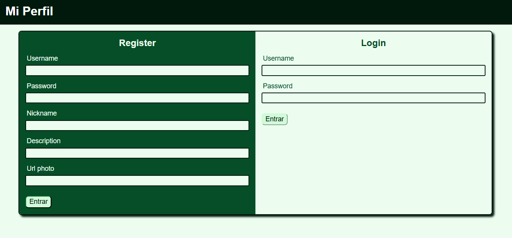
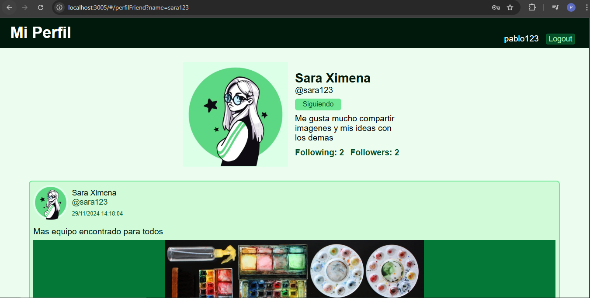

# Social Network Page

This folder contains all the files with the front-end code of this application.

## Technologies

- **Frameworks and Libraries:** React, vite, React-router-dom, Redux Toolkit.
- **Languages:** Typescript, Javascript, SASS

## Pages

### Login-Register

- **Path:** `/login`

### Home Page

- **Path:** `/home/{page}`

### Perfil

- **Path:** `/perfil`

### Perfil Friend

-**Path:** `/perfilFriend?name={username}`

### One image

- **Path:** `/oneImage?datos={idImage}`

### Followers Page

- **Path:** `/followers?name={username}&page={number}`

### Followings Page

- **Path:** `/followings?name={username}&page={number}`

